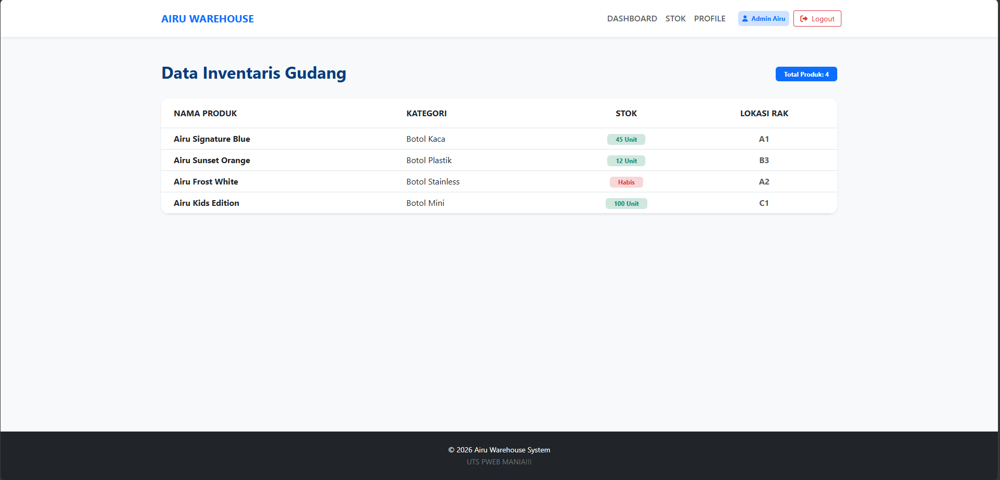

# 🌀 Airu Warehouse Management System

Sistem ini adalah sebuah aplikasi berbasis web yang digunakan untuk mengelola stok tumbler **AIRU** secara efisien dan terorganisir. Sistem ini dirancang sebagai solusi digital untuk memantau inventaris gudang secara real-time, yang menghubungkan alur autentikasi admin dengan manajemen data produk.

---

### 🚀 Fitur Utama
* **Authentication Simulation:** Sistem login berbasis data array di Controller.
* **Dynamic Data Rendering:** Menampilkan daftar stok botol Airu secara dinamis dari Controller ke View.
* **Modular Layouting:** Implementasi *Template Inheritance* (`@extends`, `@section`) dan *Blade Components* (`x-navbar`, `x-footer`).
* **Data Flow:** Pengiriman parameter `username` antar halaman melalui *Request Handling* dan *Route Parameters*.

---

### 📸 Dokumentasi Website


---

### 🔑 Akun Akses (Simulasi)
Gunakan akun berikut untuk masuk ke sistem:

| Username | Password | Role |
| :--- | :--- | :--- |
| **admin** | **admin123** | Administrator |

---

### 💻 Cara Menjalankan
1. Pastikan **Laragon**  sudah berjalan.
2. Buka terminal di folder proyek ini.
3. Jalankan perintah:
   ```bash
   php artisan serve